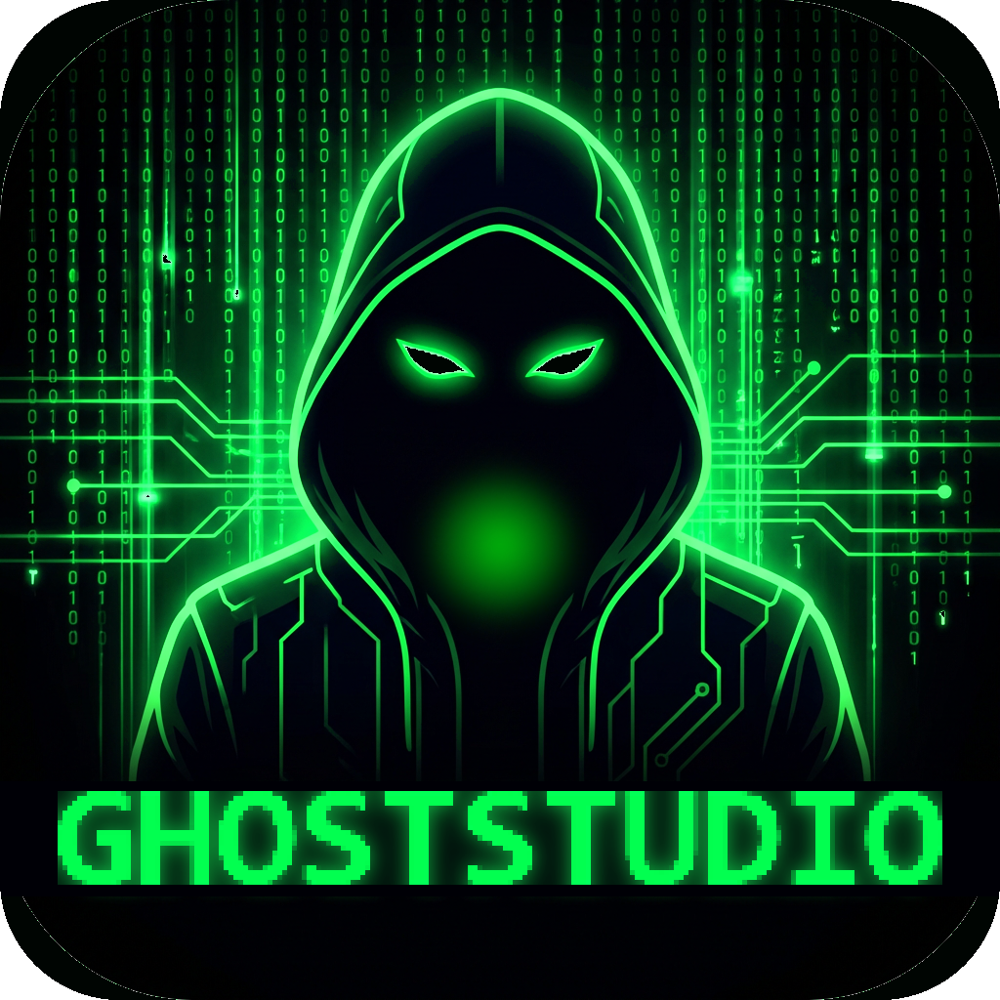

<p align="center">
  
</p>

# Ghost-Studio

**A KOTOR 1 and KOTOR 2 modding suite for model inspection, animation
retargeting, character building, module editing, map authoring, and safe
export workflows.**

Ghost-Studio is a hybrid Visual Studio C++ host plus embedded Python Qt/PySide6
desktop application. It is built for *Star Wars: Knights of the Old Republic*
and *The Sith Lords* modding workflows, with a strong bias toward preserving
source game data, validating outputs, and keeping user-facing tools separated
from reusable core systems.

The active development branch is `ghost-studio`.

> **Naming note:** the product is **GhostStudio** (formerly GhostRigger).
> Internal build identifiers still carry the original name for stability —
> the solution is `GhostRigger.sln`, native packages live under
> `native/GhostRigger.*`, environment variables use the `GHOSTRIGGER_` prefix,
> while both supported Windows build paths output `GhostStudio.exe`. The
> remaining GhostRigger identifiers are architectural identities; renaming
> them would break the build and orphan user settings, so they remain stable.

Ghost-Studio is not affiliated with LucasArts, BioWare, Obsidian, Disney,
Aspyr, or Autodesk. KOTOR game assets and Autodesk FBX SDK binaries are not
bundled.

## What It Is

Ghost-Studio is organized as four authoring studios over shared project,
resource, validation, export, scene, and native-runtime foundations.

| Studio | Purpose | Current Status |
|--------|---------|----------------|
| Character Studio | Import custom FBX/OBJ/glTF meshes, fit them to native KOTOR model hierarchies, bind/skin, preview animations and attachments, and export MDL/MDX candidates. | Active development. The main launch risk is exact Odyssey node-DAG preservation and golden playable exports. |
| Retarget Studio | Retarget animations between Unreal/Mixamo/FBX and KOTOR, KOTOR to KOTOR, and KOTOR to Unreal. | Advanced partial. Unreal/Mixamo to KOTOR is strongest; the other lanes are being brought up to the same preview/export/readback standard. |
| Module Studio | Hydrate, inspect, edit, validate, and safely save existing KOTOR modules and resources. | Backend services exist for hydration, GFF object forms, WOK editing, save manifests, and reference checks; visible editing and undo remain active work. |
| Map Studio | Author and edit KMAP-backed areas: import stock modules, edit room geometry with the Maya-style modeling shelf, paint textures live, sculpt terrain, place and configure gameplay objects, author lighting/lightmaps/skyboxes, simulate with Play-in-Editor, and package/export playable modules. | The full authoring loop works: stock import with rendered creature/placeable previews (including grafted appearance.2da heads), interactive drag/marquee multi-select with single-command undo, live map-wide texture painting with background same-ResRef cloning and an `Apply Textures` export gate, terrain sculpting with carve/fill holes and multi-loop floor-only WOK output, placement/behavior/transition authoring, world lighting and per-surface lightmap bake, five-face skyboxes and sky traffic, plus a PIE walkmesh/gameplay simulator (entity registry landed; targeting, interaction, dialogue, and combat are in progress). The user-operated in-game `warp` acceptance test of a fully authored module is the remaining proof gate. |

Shared foundations already in the repository include `GhostRiggerProject`,
`ResourceAddress`, `GameResourceProvider`, `ValidationBus`, `ExportJob`,
provider-backed resource models, native package boundaries, and embedded Python
payload generation.

## Highlights

- Qt-only desktop UI; the legacy Tk UI is retired.
- Scene-based main viewport with KMAX scene files, cameras, lights, pivots,
  transforms, gizmos, measurements, render diagnostics, and multi-object state.
- Game-library and resource browsing for K1/K2 KEY/BIF/RIM/ERF/MOD/Override
  layers.
- Retarget workbench with explicit source/target/output concepts and staged
  export gates.
- Character Builder with base skeleton selection, external mesh fit helpers,
  native skeleton build flow, supermodel assignment, BAS attachment preview,
  validation, and export preflight.
- Character Builder opens with a clear choice between that preserved **Native
  KOTOR Character** workflow and the independent, guided **Custom Rigged
  Character** workflow for foreign FBX skeletons. See
  [docs/custom_rigged_character_builder.md](docs/custom_rigged_character_builder.md).
- Body Attachment System for head, weapon, mask, goggle, belt, and equipment
  socket preview recipes. Its game-derived catalog includes every installed
  `heads.2da` head, every installed modeltype-B headless body, and attachable
  equipment from both games, plus a lightsaber Color selector spanning all
  K1/K2 blade colors (including the K2-only Viridian, Silver, and Bronze).
  The same panel is embedded in Character Builder, and the complete body plus
  attachments can be exported as one MDL/MDX, OBJ, or target-compatible FBX
  character asset.
- Lightsaber preview support for powered blade animation, game-color blade
  textures, and preview-only color overrides.
- Map Studio: import a stock KOTOR module with real rendered previews
  (creatures receive their appearance.2da heads at the body headhook),
  model rooms with the Maya-style shelf (live extrude/bevel previews, true
  Combine/Separate, Multi-Cut), paint textures directly on rendered rooms
  with Substance-informed brushes and one-transaction map-wide texture
  cloning, sculpt terrain with carve/fill holes and adaptive floor-only WOK
  output, place and configure creatures/placeables/doors/waypoints/triggers
  and room lights, bake per-surface lightmaps, author five-face skyboxes and
  animated sky traffic, and export a playable `.mod` with
  WOK/LYT/VIS/ARE/GIT/IFO/PTH — gated by raw vanilla-derived engine-contract
  validation and packaged-archive readback.
- Play-in-Editor (PIE): a deterministic editor simulator with click-to-move
  walkmesh navigation, camera and player animation, prepared creature actors,
  ambient audio, and a gameplay entity registry. PIE reports every
  unsupported behavior in its coverage warnings and is never presented as
  KOTOR engine proof.
- Native Visual Studio package tree with canonical owners under
  `native/GhostRigger.*`.

## Current Critical Path

The active roadmap is
[`knowledge_base/roadmap/02_roadmap_2026_05.md`](knowledge_base/roadmap/02_roadmap_2026_05.md).
Despite the filename, it was regenerated on 2026-06-21 and is the current suite
roadmap. A focused Map Studio audit lives at
[`Saved/Codex/brief_map_studio_full_audit.md`](Saved/Codex/brief_map_studio_full_audit.md).

Near-term priorities:

1. Expand PIE into a gameplay simulator: target acquisition and the focus
   circle HUD, a central interaction router (containers, terminals, doors,
   creatures, triggers), dialogue traversal, deterministic combat rounds, and
   cutscene sequencing — with every unsupported behavior reported honestly.
2. The user-operated in-game acceptance test: author a custom module fully
   through the Map Studio UI, export, install, and manually `warp` into it in
   KOTOR 2 to confirm every system in the actual engine.
3. A transactional Build & Test install workflow (hash-verified staging,
   game-running gate, atomic replace, rollback) replacing the current plain
   file copy.
4. Typed template deep links (`Edit Template` / `Create Variant` for
   UTC/UTD/UTT/UTE/UTS/UTM/UTW) and the Qt-free narrative core
   (script compile, dialogue, quest services).
5. Lock Character Studio native KOTOR DAG snapshot and clone-before-bind
   flow; bring the remaining Retarget Studio lanes up to the
   preview/export/readback discipline of Unreal/Mixamo-to-KOTOR.

## Installation

### Six-step Windows installation

Ghost-Studio does not yet have a one-click public installer. The first setup
builds a copy of the program on your PC. **You do not need programming
experience:** follow these six steps in order and do not skip the named
installer options.

### Download these prerequisites first

Download all three installers before beginning Step 1. These are the exact
links used for the successful tester setup:

| Required download | Direct link | Important choice during installation |
|-------------------|-------------|--------------------------------------|
| Git for Windows | **[Download Git for Windows][git-windows]** | Keep the default installer choices. |
| Visual Studio Community 2022 | **[Download Visual Studio Community 2022][vs2022-community]** | Select **Desktop development with C++**, the **MSVC v143 x64/x86 build tools**, and a Windows SDK. |
| Python 3.13.14 (64-bit) | **[Download Python 3.13.14 for Windows][python313-installer]** | Select **Add python.exe to PATH**, then **Install Now**. |

Also confirm:

- Use a 64-bit Windows 10 or Windows 11 PC with a stable internet connection.
- Make sure several gigabytes of disk space are free. Visual Studio and its C++
  tools are the largest downloads.
- Have a legal local installation of [KOTOR 1][kotor1-steam] and/or
  [KOTOR 2][kotor2-steam]. Ghost-Studio reads the game files from your
  installation; it does not include them.
- Do **not** download the Ghost-Studio repository as a ZIP. Cloning it with Git
  makes later updates much easier.

#### Step 1 — Install Git for Windows

1. Run the [Git for Windows installer][git-windows] downloaded above.
2. Keep the default installer choices.
3. Close and reopen PowerShell after installation.
4. Type the following and press Enter:

   ```powershell
   git --version
   ```

   If a version number appears, Git is ready.

#### Step 2 — Install Visual Studio Community 2022 and the C++ tools

1. Run the [Visual Studio Community 2022 installer][vs2022-community]
   downloaded above. This link is specifically for Visual Studio **2022**,
   which Ghost-Studio requires.
2. On the **Workloads** tab, select **Desktop development with C++**.
   **Game development with C++** may also be selected, but it does not replace
   the desktop C++ workload needed by this solution.
3. On the **Individual components** tab, confirm these are selected:

   - **MSVC v143 - VS 2022 C++ x64/x86 build tools**
   - A Windows 10 or Windows 11 SDK

4. Select **Install** or **Modify** and let the installer finish.
5. Close the installer. When the guide later says “Visual Studio,” open the
   purple **Visual Studio Community 2022** application—not Visual Studio 2019
   and not the Visual Studio Installer.

If Visual Studio was already installed without these options, use
[Microsoft's Modify Visual Studio guide][modify-visual-studio] and add them
now.

#### Step 3 — Install 64-bit Python 3.13

1. Run the exact tested
   [Python 3.13.14 Windows 64-bit installer][python313-installer] downloaded
   above. On its first screen, select **Add python.exe to PATH**, then choose
   **Install Now**. Keep the standard per-user installation location; the
   native Ghost-Studio project expects Python in that default folder.
2. Close and reopen PowerShell, then check the installation:

   ```powershell
   py -3.13 --version
   ```

   It should print `Python 3.13.14`.

Python 3.14 can be installed beside 3.13, but it cannot replace 3.13 for the
native Ghost-Studio build. Do not use **Customize installation**, an all-users
location, the Microsoft Store package, or Python's embeddable ZIP for this
beginner setup.

#### Step 4 — Clone Ghost-Studio

1. Open the Start menu, search for **PowerShell**, and open it. Administrator
   mode is not required.
2. Copy this entire command, paste it into PowerShell, and press Enter:

   ```powershell
   git clone --branch ghost-studio --single-branch https://github.com/CrispyW0nton/Ghost-Studio.git "$env:USERPROFILE\Documents\Ghost-Studio"
   ```

3. After the download finishes, copy and run:

   ```powershell
   Set-Location "$env:USERPROFILE\Documents\Ghost-Studio"
   git branch --show-current
   ```

   The last command should print `ghost-studio`.

This guide calls `C:\Users\YOUR-NAME\Documents\Ghost-Studio` the
**Ghost-Studio folder**. It is the folder containing `build.bat`,
`GhostRigger.sln`, and `README.md`.

#### Step 5 — Prepare the program

1. Open the Ghost-Studio folder in File Explorer.
2. Double-click `build.bat`.
3. A black window will install the required Python packages and build the
   application bundle. This can take a while; leave the window open.
4. Wait for **BUILD COMPLETE**. If it reports an error, open `build_log.txt`
   in the Ghost-Studio folder and use the troubleshooting section below.

This step creates a source bundle at `GhostStudio.exe`. Continue through
Step 6 to build the recommended native application used for Ghost-Studio's
visible testing.

#### Step 6 — Build and launch Ghost-Studio

1. Open **Visual Studio Community 2022** from the Windows Start menu.
2. On the opening screen, select **Open a project or solution**. Do not select
   **Open a local folder**.
3. Choose `GhostRigger.sln` from the Ghost-Studio folder.
4. Press `Ctrl+Alt+L` to show **Solution Explorer**.
5. Confirm its heading says `Solution 'GhostRigger' (19 of 19 projects)`.
   If it says `0 of 19`, select all unloaded projects, right-click them, and
   select **Reload Project**.
6. In the top toolbar, select **Debug** and **x64**.
7. In Solution Explorer, right-click `GhostRigger.Native.Core.Host` and select
   **Set as Startup Project**.
8. Select **Build → Build Solution**, or press `Ctrl+Shift+B`.
9. Wait for Visual Studio to report that the build succeeded.
10. In File Explorer, open:

    ```text
    Ghost-Studio\build\vs\x64\Debug
    ```

11. Double-click `GhostStudio.exe`.

Keep `GhostStudio.exe` in that `Debug` folder with its DLLs and runtime files.
**Do not move only the EXE to the main Ghost-Studio folder.** To put it on the
desktop, right-click it and choose **Send to → Desktop (create shortcut)**.

### First launch and first use

1. Open **Settings → Game Paths**.
2. Set the KOTOR 1 and/or KOTOR 2 installation folder. Common Steam locations
   are:

   ```text
   C:\Program Files (x86)\Steam\steamapps\common\swkotor
   C:\Program Files (x86)\Steam\steamapps\common\Knights of the Old Republic II
   ```

   If Steam is installed elsewhere, right-click the game in Steam and choose
   **Manage → Browse local files**. Use the folder that opens.
3. Select the option to scan or refresh the game library and wait for it to
   finish.
4. Open **Content Browser** to find and load an existing KOTOR model. Open
   **Character Studio** for custom characters, **Retarget Studio** for
   animation transfer, **Module Studio** to edit an existing module, or
   **Map Studio** to build a new area.
5. Save main-editor scenes as `.kmax` files and Map Studio projects as `.kmap`
   files. These project files store references and editor changes; they do not
   copy the game's large proprietary assets into the project.

Ghost-Studio does not silently overwrite the original KOTOR installation.
Writing or installing mod output requires an explicit export/install action.

### Updating Ghost-Studio later

You do not need to reinstall Git, Visual Studio, or Python for each update.
Open PowerShell and run:

```powershell
Set-Location "$env:USERPROFILE\Documents\Ghost-Studio"
git switch ghost-studio
git pull --ff-only origin ghost-studio
```

Then run `build.bat` again and repeat Step 6's **Build Solution** action. If
Git says local changes would be overwritten, stop and ask for help instead of
deleting files.

### Installation troubleshooting

| What you see | What it means and how to fix it |
|--------------|---------------------------------|
| `git` is not recognized | Git was not installed or PowerShell was left open during installation. Install it from [Step 1][git-windows], then close and reopen PowerShell. |
| `py -3.13` is not found | Re-run the [Python 3.13.14 installer][python313-installer], select **Add python.exe to PATH**, and keep the Python launcher enabled. |
| Visual Studio opens its Installer, or there is no **Build** menu | The C++ workload is missing, or the repository was opened as a folder. Install **Desktop development with C++**, then launch Visual Studio 2022 and use **Open a project or solution** to open `GhostRigger.sln`. |
| Solution Explorer says `0 of 19 projects` | Select all unloaded projects, right-click, and choose **Reload Project**. The heading must say `19 of 19` before building. |
| Error `MSB8020` says the `v143` tools cannot be found | Open **Visual Studio Installer → Modify → Individual components** and install the MSVC v143 x64/x86 tools. If the error path mentions `Visual Studio\2019`, close it and deliberately launch **Visual Studio Community 2022** from the Start menu. |
| `Debug` or `x64` is missing | The solution is not fully loaded. Open Solution Explorer with `Ctrl+Alt+L`, reload unloaded projects, and make sure you opened the `.sln` rather than the folder. |
| The build cannot find `Python.h`, `python313.lib`, or `python313.dll` | Reinstall the full 64-bit Python 3.13 package from Step 3. Do not use the Microsoft Store package or embeddable ZIP for the native build. |
| `build.bat` fails | Open `build_log.txt` in the Ghost-Studio folder. The final error normally identifies the missing package or file. |
| The build succeeds but the program will not start after being moved | Put the EXE back in `build\vs\x64\Debug` with the files built beside it. Create a shortcut instead of moving the EXE. |
| Ghost-Studio cannot find KOTOR | In Steam, right-click the game and choose **Manage → Browse local files**, then select that folder under **Settings → Game Paths**. |

### Optional tools and developer alternatives

- [Blender 4.2 LTS][blender42] is needed for the production Blender FBX
  import/export backend, but not for opening Ghost-Studio or browsing KOTOR
  resources.
- The [Autodesk FBX SDK][autodesk-fbx-sdk] is optional and only needed for
  SDK-backed FBX workflows. It is not bundled.
- Developers may run from source after cloning:

  ```powershell
  Set-Location "$env:USERPROFILE\Documents\Ghost-Studio"
  py -3.14 -m pip install -r requirements.txt
  py -3.14 main.py
  ```

  Replace `-3.14` with `-3.13` to use Python 3.13.

[git-windows]: https://git-scm.com/download/win
[vs2022-community]: https://aka.ms/vs/17/release/vs_community.exe
[modify-visual-studio]: https://learn.microsoft.com/en-us/visualstudio/install/modify-visual-studio?view=vs-2022
[python313-installer]: https://www.python.org/ftp/python/3.13.14/python-3.13.14-amd64.exe
[kotor1-steam]: https://store.steampowered.com/app/32370/STAR_WARS_Knights_of_the_Old_Republic/
[kotor2-steam]: https://store.steampowered.com/app/208580/STAR_WARS_Knights_of_the_Old_Republic_II_The_Sith_Lords/
[blender42]: https://www.blender.org/download/lts/4-2/
[autodesk-fbx-sdk]: https://aps.autodesk.com/developer/overview/fbx-sdk

## Building

### PyInstaller App Bundle

```bat
build.bat
```

`build.bat` resolves Python, installs `requirements.txt`, installs PyInstaller
hook helpers, compiles build-critical entry points, and runs:

```bat
python -m PyInstaller GhostRigger-K1-K2.spec --clean --noconfirm
```

Successful output:

```text
dist\GhostStudio.exe
```

Build output is written to `build_log.txt`.

### Native Solution

Native work lives in `GhostRigger.sln` and `native/GhostRigger.*`.

The payload-backed Debug application is
`build\vs\x64\Debug\GhostStudio.exe`. The repository-root copy is a
source-backed developer convenience launcher; it is runnable inside this
checkout, but it is not a portable standalone distribution without the native
payload DLLs and runtime assets from the build directory.

- Use Visual Studio for normal Debug/Release native package work.
- Keep package ownership aligned with
  [`knowledge_base/package_ownership_model.md`](knowledge_base/package_ownership_model.md).
- Edit canonical Python under root `src/...` first when a matching source file
  exists.
- Regenerate embedded Python payload copies after canonical packaged Python
  changes (`python scripts/native_python_payload_generator.py <Project>`).
- Do not hand-edit `native/<Project>/Python/src/...` copies to diverge from
  root source. Python source is mirrored across the owning native package
  tree(s) **and** the root `src/` tree; all copies must stay byte-identical or
  payload regeneration fails.

## Main Workflows

### Main Viewport And KMAX

The main viewport is a scene editor, not a single-model viewer.

Use it for loading and comparing K1/K2 models, inspecting MDL/MDX hierarchies,
previewing textures/lights/cameras/helpers/skins, transforming scene objects,
editing pivots, authoring cameras/lights, and saving `.kmax` scenes.

Workflow-specific controls belong in their owning workbench. Retarget mode,
source animation choices, output naming, and retarget export controls belong in
Retarget Studio, not the main viewport chrome.

### Retarget Studio

Supported product lanes:

- Unreal/Mixamo/FBX source animation to KOTOR target model.
- KOTOR source animation to KOTOR target model.
- KOTOR source animation to Unreal target skeleton.

Exports should only happen after preview and readback gates pass. Vanilla-slot
overrides and custom animation patches are separate output modes.

### Character Studio

Character Studio is the custom-character pipeline. The intended modder flow is:

1. Choose a base KOTOR model/skeleton.
2. Load a custom mesh.
3. Auto-fit using native KOTOR landmarks and reference bounds.
4. Fine-tune guides and mesh fit.
5. Clone/confirm the native KOTOR node hierarchy.
6. Bind skin rows.
7. Assign inherited supermodel or local animations.
8. Preview heads, weapons, masks, goggles, belts, and attachments.
9. Run validation/export preflight.
10. Export MDL/MDX candidates and test in game.

Do not claim a custom character is game-ready until viewport preview, export
readback, and in-game testing have passed.

### Combined Character FBX Export For Unity And Unreal

Ghost-Studio can export one composed character asset containing the selected
body, head, weapons, mask, goggles, belt, and any other active Body Attachment
System (BAS) layers. The exporter preserves the native Odyssey hierarchy,
skinning, UVs, material slots, texture references, and selected animations.

"Combined" means one FBX file, one character hierarchy, and one skeletal asset.
The individual mesh sections and material slots remain logically separate
inside that asset. Ghost-Studio does not destructively weld the body, eyes,
teeth, clothing, weapons, and accessories into one vertex/material stream,
because doing that would damage skinning, UV seams, material assignment, and
attachment transforms.

#### Export A Body And Its Attachments

1. Configure and scan the K1 and/or K2 game installation under **Settings ->
   Game Paths**.
2. Load a body, or select one from the BAS **BODY** catalog. BAS lists the
   available game-owned heads and headless modeltype-B bodies separately for
   K1 and K2 so resources from different games are not mixed silently.
3. Attach the desired head and equipment. Confirm the composed preview looks
   correct and that every layer is attached to the expected hook.
4. In the main BAS panel, choose **Export Composed Model...**. Character
   Builder users can instead choose FBX in its normal Export dialog. Main
   viewport **Export FBX** and single selected-object export use the same
   compatibility pipeline when a runtime model is available.
5. Select the FBX profile in the save/export dialog:

   - **Unity-Compatible FBX** for Unity.
   - **Unreal Engine-Compatible FBX** for Unreal Engine.
   - **3ds Max-Compatible FBX** for Autodesk 3ds Max.
   - **Standard FBX** only when the destination does not need one of the
     target-specific handoff rules.

6. Choose the animation sets to embed. Each checked row becomes an independent
   FBX take/clip. The list includes the animation name, source model, whether
   it is local or inherited, and its duration.
7. Select **Continue**. Canceling either dialog leaves the scene unchanged and
   writes no export.

The animation-selector shortcuts are:

| Control | Result |
|---------|--------|
| **Select Current** | Export only the animation currently selected for preview. |
| **Select Local** | Export only clips stored directly on the primary body/model. |
| **Select All** | Export every animation resolved through the model's strict same-game supermodel chain. This can create a large FBX. |
| **Clear** | Export the combined mesh and rig with no animation clips. |
| Row checkboxes/search | Find and select only the clips needed by the destination project. |

Selecting a small intentional set is recommended. A KOTOR humanoid may expose
hundreds of inherited animations, and importing all of them increases FBX size
and engine import time.

#### How Animation Resolution Works

- A local body clip wins over a same-named inherited clip.
- Otherwise Ghost-Studio resolves the clip through that model's K1 or K2
  supermodel chain and records the owning source model.
- For a composed body and head, the body's effective clip provides the body
  motion. The attached head contributes only same-named tracks for nodes that
  actually belong to that head, including jaw, lip, eyelid, and eye tracks
  inherited from the head's own supermodel.
- A conflicting track for a real body-owned node remains body-authoritative;
  head inheritance cannot replace pelvis, limb, or root motion.
- Each selected inherited clip gets its own cumulative translation scale baked
  into the exported copy. Mixed local and inherited clips therefore do not
  share an incorrect model-wide animation scale.
- Selection and baking operate on a deep copy. The loaded scene, source game
  resources, body model, head model, and original animations are not mutated.
- If a requested name cannot be resolved, export stops with an error instead
  of silently omitting the animation.

#### Files Produced

Keep the complete output folder together:

```text
CharacterName.fbx
CharacterName.ghostrigger.json
textures/
  body_texture.png
  head_texture.png
rigging/                       # when rigging sidecars are enabled
  CharacterName.skeleton.json
  CharacterName.weights.json
  CharacterName.<clip>.anim.json
```

The `.ghostrigger.json` manifest records the compatibility profile, selected
and embedded animation names, missing-name check, source models, inheritance
scope, scale, contributing attachment models, coordinate/unit policy, and
recommended engine import settings. The FBX is the engine asset; the manifest
and rigging JSON preserve Ghost-Studio/KOTOR handoff and diagnostic metadata.

#### Import In Unity

1. Copy the **entire exported folder** under the Unity project's `Assets`
   directory. Do not copy only the FBX; its relative `textures/` references
   need to remain beside it.
2. Select the FBX and use **Scale Factor 1**, **Use File Scale**, and **Bake Axis
   Conversion**.
3. On the Rig tab, use a **Generic** rig unless the character has separately
   been mapped to a valid Unity Humanoid avatar.
4. Enable **Import Animation**. For the closest KOTOR curve result, use
   **Animation Compression: Off** and disable **Resample Curves**.
5. Enable material/texture import and apply the settings. The selected takes
   appear as separately named Unity `AnimationClip` assets.

The Unity profile declares the correct meter-scale handoff, emits clean clip
names, complete mesh-to-bone inverse bind data, linear animation keys, and
continuous Euler branches. These rules prevent the exploded/deformed meshes,
overshooting joints, scale errors, and clip-name artifacts caused by the old
generic FBX handoff.

#### Import In Unreal Engine

1. Import the FBX as a **Skeletal Mesh** with **Import Mesh**, **Import
   Animations**, **Import Materials**, and **Import Textures** enabled.
2. Enable **Import Meshes in Bone Hierarchy**. This is required so rigid eyes,
   eyelids, teeth, tongue, and similar child meshes remain geometry instead of
   being converted into bones.
3. Enable scene/unit conversion, preserve smoothing groups, and import normals
   and tangents when present.
4. Import the exported animation time at 30 fps. Keep **Use T0 As Ref Pose**
   and **Update Skeleton Reference Pose** disabled unless the first frame was
   intentionally authored as a replacement bind pose.
5. Unreal creates a separate `AnimSequence` for each selected FBX take on the
   same imported skeleton.

The Unreal profile preserves the native Odyssey skeleton and bone names; it
does not silently retarget the character to Quinn or the Unreal mannequin.
Create an Unreal IK Rig/IK Retargeter after import when mannequin/Quinn
compatibility is required.

#### Troubleshooting

- **White or missing textures:** import/copy the whole output folder, keep the
  `textures/` directory beside the FBX, and enable material/texture import.
- **Exploded or extremely deformed character:** re-export with the correct
  Unity or Unreal profile, import at scale 1, and do not add a manual 90-degree
  root rotation or replace the skeleton reference pose during import.
- **Eyes or teeth missing in Unreal:** enable **Import Meshes in Bone
  Hierarchy**.
- **No clips appear:** confirm at least one checkbox was selected. **Clear** is
  intentionally the mesh-and-rig-only mode.
- **Import is unexpectedly slow or the file is huge:** avoid **Select All** and
  export only the animation sets the project will use.
- **Need a single welded mesh:** perform that destructive optimization later in
  a DCC tool only after deciding how materials, UVs, rigid accessories, and
  skin weights should be collapsed. It is not the safe interchange default.

### Module Studio And Map Studio

Module Studio edits existing KOTOR module resources. Map Studio authors and
edits custom modules and areas. Both must preserve source game data unless the
user explicitly chooses an export/write operation.

Map Studio editing flow:

1. **File -> Import Stock Module (RIM)** or **Rooms -> Load LYT** to hydrate a
   vanilla module (rooms, placements, GIT/IFO entry data — creatures render
   with their real bodies and heads), or start a fresh authored module from a
   room preset or terrain patch.
2. **File -> Make All Stock Rooms Editable** (or edit a hovered stock room,
   which auto-converts it) to turn read-only stock geometry into editable
   imported-mesh rooms.
3. Model with the Maya-style shelf: Object/Vertex/Edge/Face/Terrain/Walkmesh
   modes with Select, Move, Dupe, Delete, Snap, Weld, Cut, Split, Bridge,
   Extrude, and Bevel. Extrude and Bevel preview live topology before commit;
   Combine/Separate produce real polygon meshes. Plain click-drag marquee
   (or Ctrl+drag) box-selects objects; Delete removes the whole selection as
   one undoable command; End drops a placement to the walkable ground;
   W/E/R switch gizmo modes; Ctrl+Z / Ctrl+R undo/redo, and undoing a
   placement move repaints just that object.
4. Paint: clone used room textures into project TGA/TXI overrides (map-wide,
   background, cancellable, one undo transaction) and paint directly on the
   rendered map with size/hardness/opacity/flow/spacing/jitter and
   pressure-aware brushes; commit with the `Apply Textures` export gate.
5. Sculpt terrain with raise/lower/smooth/flatten/ramp brushes, carve or fill
   floor holes (the exported walkmesh gains real interior perimeter loops),
   and validate the generated floor-only WOK with the live green/red
   walkability overlay.
6. Place creatures, placeables, doors, waypoints, triggers, sounds, and room
   lights; author faction/roam behavior, conversations, locks, transitions,
   world lighting, per-surface lightmaps, five-face skyboxes, and sky
   traffic.
7. Press Play for PIE simulation (click-to-move walkmesh navigation with
   honest coverage reporting), then Validate, stage, and export a playable
   `.mod` — every writer output passes raw vanilla-derived engine-contract
   checks and archive readback before install.
8. Install the exported module and manually `warp` into it in game. PIE and
   editor validation are never a substitute for that in-game proof.

New geometry is textured with world-space tiled UVs matched to the room's
existing texture density so it blends with vanilla; polycount guardrails warn
before KOTOR MDL limits.

## FBX Backends

Ghost-Studio keeps FBX backends explicit.

| Backend | Use | Notes |
|---------|-----|-------|
| Blender Headless | Production FBX import/export bridge for animation and mesh extraction. | Requires Blender 4.2 LTS or `GHOSTRIGGER_BLENDER_PATH`. |
| Autodesk FBX SDK | Optional SDK-backed path. | Must be installed manually. SDK binaries are not committed or bundled. |
| Generic Assimp paths | Legacy/static mesh import support. | Useful for some main-viewport file imports, not a replacement for Retarget Studio animation import. |

Autodesk SDK smoke check:

```bat
python -c "import fbx; m=fbx.FbxManager.Create(); print(m.GetVersion()); m.Destroy()"
```

Blender is not treated as a silent fallback for Autodesk SDK requests. If a
workflow asks for Autodesk and the SDK is missing, Ghost-Studio should fail with
an actionable setup message unless that workflow explicitly opts into a
fallback.

## Validation And Export Safety

Export workflows should:

1. Run validation/preflight before writing.
2. Stage output files.
3. Verify staged outputs.
4. Promote files only after verification.
5. Avoid partial writes.
6. Report actionable issues through `ValidationBus`.

KOTOR source data should never be overwritten silently.

## Testing

Prefer targeted checks:

```bat
python -m py_compile main.py
python -m pytest tests/test_fbx_backend_registry.py -q
python -m pytest tests/test_character_builder_template_rig.py -q
python -m pytest tests/test_map_studio_terrain_patch.py -q
python -m pytest tests/test_authored_imported_mesh.py -q
```

Use MCP/game-file validation tools for model-pipeline truth: MDL loading,
vertex transforms, textures, skinning, model comparison, and game-file parsing.

Visible UI, startup, viewport, theme/layout, renderer, animation playback, and
workflow behavior must be tested in the real Ghost-Studio Debug application.
Backend probes are not a substitute for visible workflow testing.

Do not run broad full scans unless the task explicitly requires them.

## Repository Map

```text
src/                         Canonical Python source for app and domain logic.
native/                      Visual Studio C++ package tree and embedded Python payloads.
config/                      Themes, layouts, and runtime configuration assets.
assets/icons/                Application icon assets.
examples/                    Example KMAX/KMAP and workflow data.
scripts/                     Build, payload, validation, smoke, and utility scripts.
tests/                       Targeted unit, contract, workflow, native, and regression tests.
knowledge_base/              Active roadmap, architecture, native migration, and references.
docs/knowledgebase/          Local book-derived agent skill notes.
Saved/Codex/                 Design briefs and audits (e.g. the Map Studio full audit).
```

## Documentation

Start here:

- [Active roadmap](knowledge_base/roadmap/02_roadmap_2026_05.md)
- [Roadmap index](knowledge_base/roadmap/README.md)
- [Package ownership model](knowledge_base/package_ownership_model.md)
- [Native migration plan](knowledge_base/native_migration_plan.md)
- [C++ integration phases](knowledge_base/cpp_integration_phases.md)
- [Map Studio full audit](Saved/Codex/brief_map_studio_full_audit.md)
- [Knowledge base index](knowledge_base/README.md)
- [Agent operating manual](AGENTS.md)

## Branch And Contribution Policy

- Primary development branch: `ghost-studio` (formerly `qt-ghostrigger`).
- Legacy branches are historical references; do not base new feature work on
  them.
- Commit messages should include the relevant roadmap task ID when one applies.
- Future PRs should target `ghost-studio`.
- Keep generated output, proprietary game assets, local screenshots, books, and
  dependency caches out of commits unless a tracked fixture is explicitly
  required.

## License And Legal

See [LICENSE](LICENSE).

Ghost-Studio does not bundle KOTOR game assets or Autodesk FBX SDK binaries.
Users are responsible for using legal local game installs and third-party SDKs
according to their licenses.
